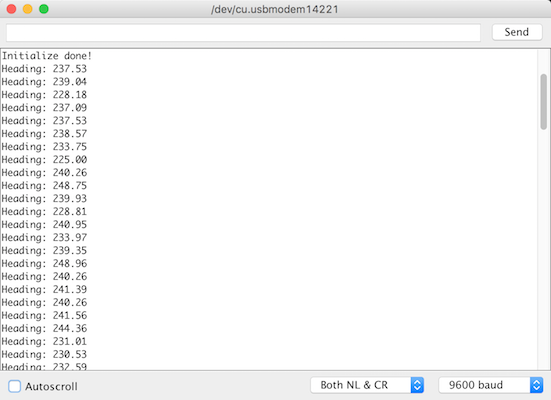
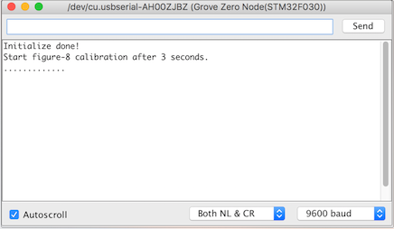
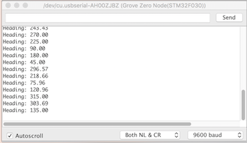

# Grove_3_Axis_Compass_V2.0(BMM150)
This is Arduino library for **Bosch BMM150** a Geomagnetic Sensor IC.

[Grove - 3-Axis Digital Compass V2](https://www.seeedstudio.com/Grove-3-Axis-Digital-Compass-V2-p-3034.html)

The Grove - 3-Axis Digital Compass V2 is a digital compass sensor based on Bosch BMM150. It allows measurement of the magnatic field in three perpendicular axes and the output can be read out over I2C interface, perfectly suitable for 3-Axis mobile applications.

Key features
===

| IC Name | Interface | Votage Range | VDDIO Range | Magnetic Range           | Magnetic Resolution | Output Degree |
| ------- | --------- | ------------ | ----------- | ------------------------ | ------------------- | ------------- |
| BMM150  | I2C       | 3.3V ~ 5.0V  | 1.2V ~ 3.6V | ±1300µT(x,y), ±2500μT(z) | ~0.3μT              | 0º ~ 360º     |

Usage
===
### Basic example

1. Taking an Arduino board, connect Grove_3_Axis_Compass_V2.0(BBM150) to the I2C port.
2. Open example/compass/compass.ino.
3. Compile and upload sketch.
4. Open Arduino serial monitor.

5. Heading value is in range of 0º ~ 360º, this value is for Y axis, 0º means **Y** axis points at **North**, 90º means **Y** axis points at **West**, 180º means **Y** axis points at **South**, 270º means **Y** points at **East**. 

### Example use figure-8 calibration
1. Open example/figure8_calibration/figure8_calibration.ino.
2. Compile and upload sketch.
3. Open Arduino serial monitor.
  
**Figure-8 Calibration**, the figure-8 calibration is an easy way to get offset values for x/y/z axis. 
  
6. Do figure-8 calibration in 10 seconds while serial monitor echo dot symbol. The calibration period can be changed through the parameter timeout in **calibrate(uint16_t timeout)**. 

For more infomation refer to [wiki page]().

------

This software is written by Lambor for Seeed Studio and is licensed under [The MIT License](http://opensource.org/licenses/mit-license.php). Check License.txt for more information. 

Contributing to this software is warmly welcomed. You can do this basically by 
[forking](https://help.github.com/articles/fork-a-repo), committing modifications and then [pulling requests](https://help.github.com/articles/using-pull-requests) (follow the links above 
for operating guide). Adding change log and your contact into file header is encouraged. 
Thanks for your contribution.

Seeed is a hardware innovation platform for makers to grow inspirations into differentiating products. By working closely with technology providers of all scale, Seeed provides accessible technologies with quality, speed and supply chain knowledge. When prototypes are ready to iterate, Seeed helps productize 1 to 1,000 pcs using in-house engineering, supply chain management and agile manufacture forces. Seeed also team up with incubators, Chinese tech ecosystem, investors and distribution channels to portal Maker startups beyond.

